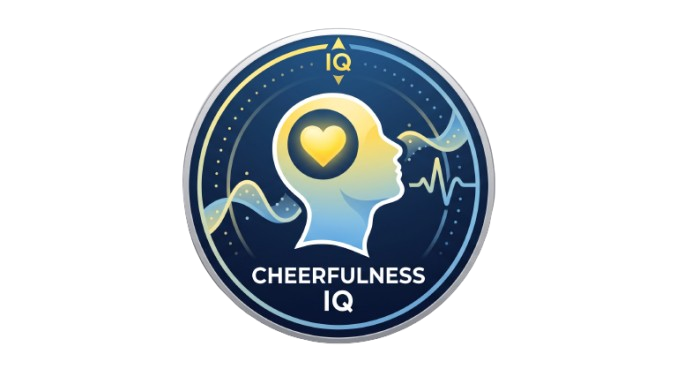

# Cheerfulness IQ



A Garmin Connect IQ widget that delivers motivational quotes matched to your current physiological state. Reads stress and body battery metrics, selects content for your real-time nervous system condition, and appears in the watch face glance loop.

## How It Works

Each time you open the widget, Cheerfulness IQ evaluates the last 5 minutes of your biometric data and classifies your state into one of four quadrants:

| Mood | Stress | Body Battery | Content |
|------|--------|-------------|---------|
| **Wired** | High | High | Tactical, sharp, execution-focused |
| **Prime** | Low | High | Expansive, visionary, proactive |
| **Burnout** | High | Low | Grounding, resilient, compassionate |
| **Resting** | Low | Low | Restorative, calm, validating |

A 3% chaos roll occasionally serves a quote from a random mood to introduce fresh perspectives. Evaluation is cached for 5 minutes to avoid redundant sensor reads.

### Controls

- **UP/DOWN** — Scroll quote text vertically
- **SELECT** — Open menu: advance to next quote or force-select a mood
- The widget appears in the watch face scroll loop via `GlanceView`

## Architecture

### 64,000 Quotes, On-Device

Quotes are stored as 642 JSON string shard files (225 per Resting/Prime, 100 for Burnout, 92 for Wired; 100 quotes per shard, ~24 KB each). The engine loads one shard at a time, extracts a single quote via `\n|\n` separator scanning, and immediately nulls the buffer — peak heap usage stays under ~50 KB. Quote persists in `Application.Storage` across widget restarts until the mood changes or the user selects "Next Quote".

### Quote Selection

Per-mood counts are unequal — the Python pipeline dynamically sets each mood's target to `max(10000, keyword_matched_quotes)` capped at 22500. If keyword-matched quotes in the DB are insufficient, random-fill from the general pool brings the mood to 10000. The last shard of each mood may contain fewer than 100 quotes; `_readQuoteFromShard` relies on the retry loop when the random index exceeds the actual shard count.

### Project Structure

```
source/
  CheerfulnessIQApp.mc              — App entry point (extends AppBase)
  Core/
    Biometrics.mc                   — Stress/BB evaluation + 3% chaos roll
    Mood.mc                         — Mood enum, labels, bitmap IDs
    QuoteEngine.mc                  — Random quote picker with shard scanning
    ShardIndex.mc                   — Auto-generated ResourceId lookup table
  UI/
    CheerfulnessIQView.mc           — 30/70 viewport with mood photo + TextArea
    CheerfulnessIQDelegate.mc       — UP/DOWN scroll, SELECT menu trigger
    CheerfulnessIQMenuDelegate.mc   — Menu2 handler (advance, force mood)
    CheerfulnessIQGlanceView.mc     — Title text for watch face glance loop
scripts/
    build_shards.py                 — Pipeline: extract + pack + index
    extract_quotes.py               — Keyword-score 286K quotes into 4 moods
resources/
    quotes/*.json                   — 642 JSON string shard files
    drawables/*.png                 — 4 mood photos + launcher icon
```

## Building & Running

### Prerequisites

- Connect IQ SDK 5.2.0+
- A Garmin developer key (`.der` file)
- Python 3.11+ with `requests`

### Data Pipeline

```bash
python scripts/build_shards.py
```

Downloads the quotes database on first run (~114 MB, cached in `%TEMP%`), extracts ~64K quotes scored by mood keywords, and generates the JSON shard files + `resources/resources.xml` + `source/Core/ShardIndex.mc`.

### Compile

```bash
monkeyc -d fr255m_sim -f monkey.jungle -o bin/CheerfulnessIQ.prg -y /path/to/developer_key.der
```

Or build from VS Code with the Connect IQ extension.

### Supported Devices

Forerunner 255, 255 Music, 255s, 255s Music, 265

## License & Attribution

### Quotes Dataset

All quotes are sourced from [quotes_library](https://github.com/mymi14s/quotes_library) by **Anthony Emmanuel** (mymi14s), used under the MIT License.

```
MIT License
Copyright (c) 2024 Anthony Emmanuel
Permission is hereby granted, free of charge, to any person obtaining a copy
of this software and associated documentation files (the "Software"), to deal
in the Software without restriction, including without limitation the rights
to use, copy, modify, merge, publish, distribute, sublicense, and/or sell
copies of the Software, and to permit persons to whom the Software is
furnished to do so, subject to the following conditions:
The above copyright notice and this permission notice shall be included in all
copies or substantial portions of the Software.
```

### Background Images

Mood photographs are under a free-to-use commercial license.

### This Project

```
MIT License
Copyright (c) 2024 Cheerfulness IQ Contributors
Permission is hereby granted, free of charge, to any person obtaining a copy
of this software and associated documentation files (the "Software"), to deal
in the Software without restriction, including without limitation the rights
to use, copy, modify, merge, publish, distribute, sublicense, and/or sell
copies of the Software, and to permit persons to whom the Software is
furnished to do so, subject to the following conditions:
The above copyright notice and this permission notice shall be included in all
copies or substantial portions of the Software.
```
